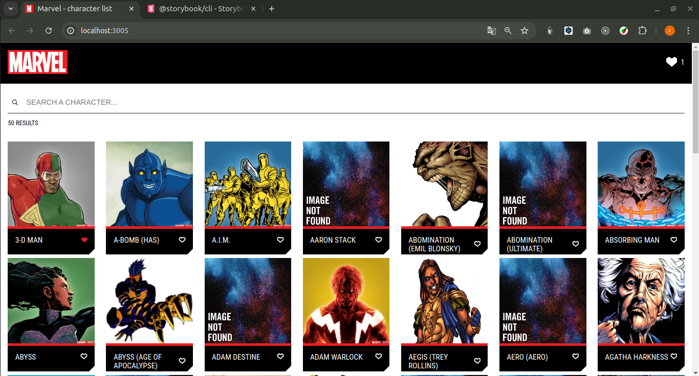

#  Marvel App

## ⚠️ **Importante**

> **Documentación e Historias (Storybook):**
>
> Toda la aplicación se encuentra documentada componente por componente. Además, los test son visuales en la herramienta, en el apartado _Interactions_.

> **Deploy:**
>
> Tanto la aplicación como las historias y documentación de componentes se encuentran desplegadas en AWS en el servicio Lightsail. Puede ver:
>
> - **Historias (StoryBook):** [https://files.ridaoc.es/](https://files.ridaoc.es/)
> - **Aplicación Marvel App:** [https://server.ridaoc.es/](https://server.ridaoc.es/)

> **Tutorial:**
>
> Para ver la respuesta a la solución en detalle puede ingresar a esta pagina, ella tiene una tabla de contenido, en el cual puede redirigirse a la sección que desee
>
> - **Detalle Prueba Técnica:** [https://client.ridaoc.es/](https://client.ridaoc.es/)

## Resumen

Este proyecto consiste en la creación de una pequeña aplicación para obtener información sobre diferentes personajes de Marvel.

## Descripción de las Vistas

### Vista Principal - Listado de personajes

- **Requerimientos**:

  - Mostrará un listado de 50 personajes o el resultado de los personajes introducidos en el buscador.
  - Al hacer clic en el icono superior de favoritos, se deberán mostrar los personajes favoritos almacenados.

  

#### Funcionalidad

- Inicialmente la página debe mostrar los primeros 50 personajes.
- La vista debe contener:
  - Un icono con el logotipo.
  - Un icono que mostrará el número de personajes favoritos.
  - Una barra de búsqueda en la que se podrán buscar personajes por su nombre. (Ejemplo: Si se busca por “Spider” se deberían mostrar todos los nombres que contengan dicha palabra).
  - Un contador con los resultados obtenidos tras cada búsqueda que se actualizará en tiempo real.
  - Un listado de resultados, cada uno de los cuales contendrá la imagen, nombre del personaje y una opción para añadir el personaje a favoritos.

### Detalle de personaje

- **Requerimientos**:

  - Mostrará información relativa al personaje y los cómics en los que aparece.

  

#### Funcionalidad

- La vista debe de contener:
  - Un icono con el logotipo. Al pulsar en dicho enlace se redirigirá a la vista principal (Página de listado de personajes).
  - Un icono que mostrará el número de personajes favoritos. Al pulsar en dicho icono se redirigirá a la vista principal, mostrando el listado de personajes favoritos almacenados.
  - La imagen, título y descripción del personaje, así como la opción de añadir al personaje como favorito.
  - Un listado de los cómics del personaje ordenados por fecha de salida.
  - Solo se deberán mostrar los primeros 20 cómics de cada personaje.

## Stack

- **sass**: 1.77.4
- **react**: 18.3.1
- **babel**: 7.24.7,
- **eslint**: 8.57.0
- **webpack**: 5.91.0,
- **prettier**: 3.3.1
- **storybook**: 8.1.6
- **react-router-dom**: 6.23.1
- **@storybook/test**: 8.1.6,
- **@storybook/test-runner**: 0.18.2
- **@storybook/testing-library**: 0.2.2

## Instalación y Configuración

### Decisiones de Diseño

- **Arquitectura**: La aplicación está basada en componentes, es modular y escalable.
- **Gestión de Estado**: Utilizamos ContextAPI de React para la gestión global del estado.
- **Caché**: Implementación de almacenamiento en localStorage para mejorar la eficiencia y reducir cargas innecesarias.
- **Rutas Limpias**: Uso de react-router-dom para manejar rutas sin hashes.

### Requisitos Previos

- Node.js (versión 18 o superior)
- npm (versión 10 o superior)

### Clonar el Repositorio

```bash
git clone https://github.com/ridaoc19/marvel-app
cd marvel-app
```

### Instalación de Dependencias

```bash
npm install
```

### Variables de Entorno
Para que la aplicación funcione correctamente, necesitas configurar las siguientes variables de entorno en un archivo .env en la raíz del proyecto:

```bash
REACT_APP_API_KEY=XXXXXX
REACT_APP_HASH=XXXXXX
REACT_APP_TS=XXXX
```

### Modo Development

```bash
npm start
```

### Modo Production

```bash
npm run build
```

### Ejecutar Tests y documentación

Para iniciar Storybook, utiliza el comando `npm run storybook`. Para verificar la integridad y el funcionamiento de las historias, así como para garantizar que las pruebas estén en orden, ejecuta `npm run test-storybook`. Es importante destacar que este último comando solo funcionará si ya has iniciado Storybook con el comando anterior.

Cada componente cuenta con su propia historia, test y documentación. Puedes explorar estas historias en detalle en nuestro entorno de producción en https://files.ridaoc.es/. Recuerda que cada componente es independiente, lo que facilita su comprensión y pruebas por separado.

```bash
npm run storybook
npm run test-storybook
```


### Pruebas, Validación y herramientas

- **ESlint**: Configurado con ESLint para mantener el código limpio y sin errores.

```bash
npm run lint
```

- **Prettier**: Para mantener un código limpio y consistente, se ha integrado [Prettier](https://prettier.io/) en este proyecto. Prettier es una herramienta de formateo de código que asegura que todo el código siga un estilo uniforme.

```bash
npm run format
```

- **Tests**: Configuración de Jest y react testing library en Storybook para realizar testing, se puede verificar en las historias en el apartado iteraciones, ademas puede realizar testing de las historias.
- **Consola**: La aplicación debe estar libre de errores en la consola del navegador.
- **Storybook**: [Storybook](https://storybook.js.org/) es herramienta de desarrollo el cual me ayudo a desarrollar componentes de forma independiente y a documentarlos.


Este proyecto fue desarrollado por **Ricardo David Ocampo**.

- **LinkedIn:** [https://www.linkedin.com/in/ridaoc19](https://www.linkedin.com/in/ridaoc19)
- **GitHub:** [https://github.com/ridaoc19](https://github.com/ridaoc19)
